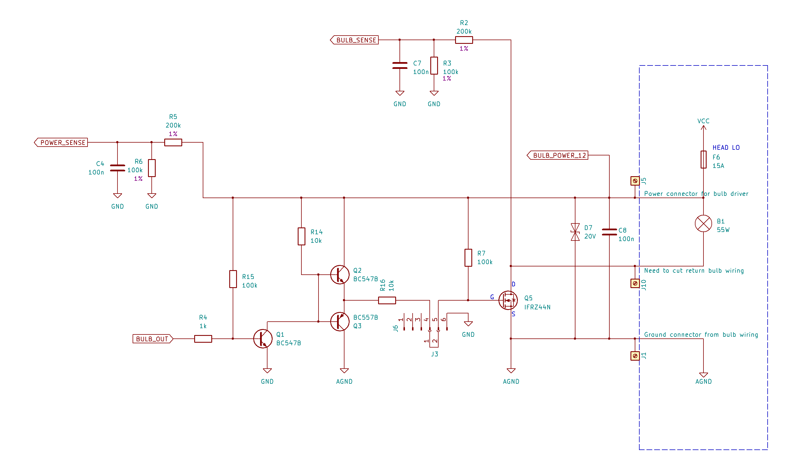
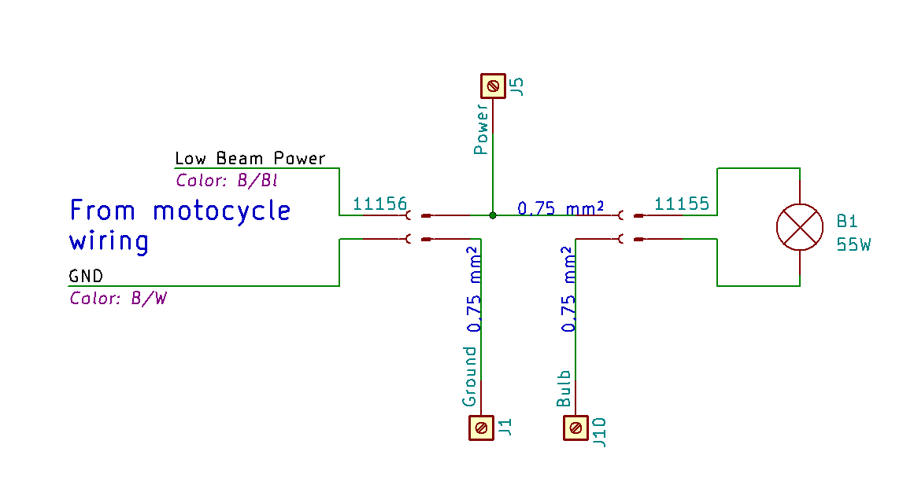
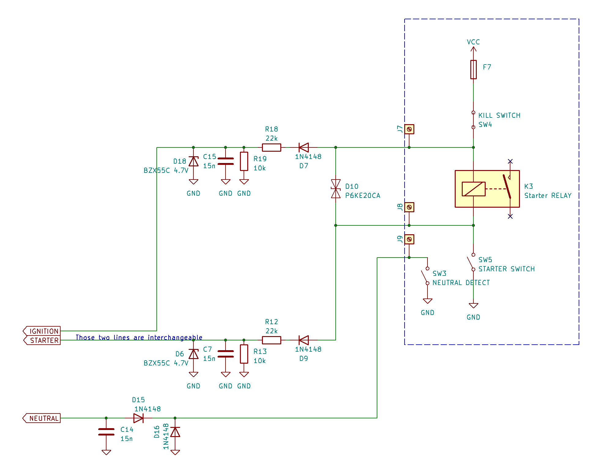
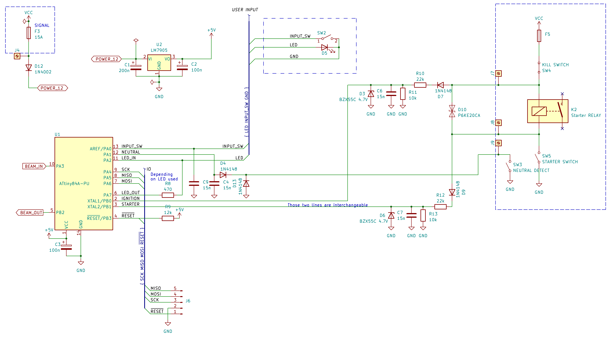

# Cel projektu

Proste urządzenie, które wyłączy światła mijania, gdy nie są potrzebne.
Dedykowane dla motocykla Suzuki V-Strom 650, roczniki od 2017 wzwyż.
Zaimplementowany algorytm realizuje moje wymagania, tzn. wpisuje się w mój sposób eksploatacji motocykla. 

## Od strony użytkownika

Zacznijmy od tego, że podchodzę do motocykla, włączam stacyjkę. Normalnie światła już świecą, ale po co. Póki co mam odcięty zapłon na _kill-switch_, a bieg na luzie. Włączam _kill-switch_, moto odpala, ale ja przecież jeszcze nigdzie nie jadę - kask trzeba ubrać, wsiąść, stopkę złożyć. I gdy już to wszystko jest zrobione, włączam bieg (magia, ta dam), światła się zapalają, a ja odjeżdżam. Niekoniecznie w stronę słońca, bo czasem razi, ale daleko.
Dojeżdżając do skrzyżowania, wyłączam bieg, ale wtedy światła już nie gasną. No chyba, że dojechałem do przejazdu kolejowego, i wiem, że chwilę postoję. Gaszę wtedy silnik _kill-switchem_, a światła automatycznie gasną. Zapalą się znów, gdy będzie włączony bieg oraz _kill-switch_ w pozycji do jazdy.
A gdyby mi po drodze przez przypadek zgasł silnik, to światła zgasną tylko na czas kręcenia rozrusznikiem.

Dodatkowo, mam do dyspozycji przycisk, który zmienia stan świateł na przeciwne (włączone-wyłączone). Przykładowo, gdy chcę sobie poświecić. Albo na czas jazdy w _offie_ wyłączyć światła. Przydaje się tutaj taki trik, a mianowicie przytrzymując przycisk w momencie włączania biegu (czyli wtedy, gdy światła się włączają) blokuję ich automatyczne włączenie.

## Dioda

Dioda generalnie odzwierciedla stan świateł, tzn. powinna być włączona, gdy światła są włączone, oraz wyłączona, gdy są wyłączone.
Dodatkowo, po włączeniu stacyjki, świeci się przez sekundę, nawet jeżeli światła powinny być wyłączone.

    ¯¯¯¯¯¯-___ ........... _-¯¯¯¯¯-_____-¯¯¯¯¯-_____-¯¯¯¯¯¯¯¯¯¯¯
    +-----+-----+-----+-----+-----+-----+-----+-----+-----+-----
    ↑     ^ sekunda i gaśnie       ^ a tu sobie powoli miga
    włączam stacyjkę                 oznaczając, że światła 
                                     się właśnie zapalają
Jeżeli dioda miga krótkimi, pojedynczymi „mrugnięciami”, to znaczy, że żarówka albo bezpiecznik są przepalone:

    _______¯_____¯_____¯____
    ...---+-----+-----+-----

Jeżeli miga jak szalona, to znaczy, że coś jest nie tak. Np wsadziliśmy żarówkę zbyt małej mocy:

    _¯_¯_¯_¯_¯_¯_¯_¯_¯_¯_¯_¯
    +-----+-----+-----+-----

Natomiast, jeżeli w trakcie normalnej jazdy, będzie przez sekundę mrugała jak szalona (pytanie, czy to da się zauważyć), oznacza to nieprzyjemną sytuację, gdy sterownik się zrestartował w wyniku jakiegoś błędu:

    ¯¯¯¯¯¯¯¯¯¯¯¯_¯_¯_¯_¯¯¯¯¯¯¯¯¯¯¯
    +-----+-----+-----+-----+-----

   
# Sprzęt

## Mikrokontroler

Pracuję na ATTiny 84A, aczkolwiek projekt powinien dać się zaadaptować na inne mikrokontrolery o podobnych możliwościach sprzętowych. W szczególności na rodzinę ATTiny x4A.

### FUSE bits

Do domyślnej konfiguracji mikrokontrolera zostały wprowadzone następujące zmiany:
* włączenie timera watchdog,
* ustawienie detekcji spadku napięcia zasilania na około 4,3 V. Poniżej tej wartości mikrokontroler jest zablokowany w stanie RESET,
* maksymalna redukcja czasu oczekiwania po włączeniu zasilania.

**hfuse** - `0xCC`
`SPIEN = 0` - serial programmig interface enabled
`WDTON = 0` - watchdog timer always on
`BODLEVEL[2:0] = 100` - BOD level = 4,3 V

**lfuse** - `0x42`
`CKDIV8 = 0` - divide system clock by 8
`SUT[1:0] = 00`  - startup time 14CK
`CKSEL[3:0] = 0010` - 8 MHz internal oscilator 

## Moduł mocy

Moduł mocy oparty jest o tranzystor Q5 MOSFET IRF540N. Pozwala on na sterowanie prądem do 33 A przy oporności załączonego tranzystora 44 mΩ. Teoretycznie więc można podpiąć nie tylko światła mijania, ale także światła drogowe, chociaż ja się na to nie zdecydowałem, żeby mieć zawsze możliwość ich włączenia.

Na testach okazało się, że dla żarówki 55 W zasilanej z akumulatora (około 12,6 V) na tranzystorze jest spadek napięcia odpowiadający oporności około 66 mΩ, co powoduje straty mocy rzędu 1,5 W. Wg danych producenta, *Junction-to-Ambient Thermal Resistance* to 62 °C/W, więc tranzystor bez radiatora będzie się grzał do temperatury około 26 °C (temperatura otocznia) + 62 x 1,5 ≈ 120 °C, co nie przekracza dopuszczalnej temperatury pracy 175 °C. Pomimo tego zdecydowałem się zastosować radiator - metalową płytkę o rozmiarach około 8 mm x 5 cm. Przy takim radiatorze temperatura tranzystora nie przekraczała 50 °C.

Sterowanie tranzystora Q5 jest zrealizowane za pomocą wzmacniacza i adaptera poziomu TTL (5 V) do 12 V zbudowanego na tranzystorach Q3 i Q4. Ładowanie bramki odbywa się przez nasycenie tranzystora Q4, a rozładowanie przez opornik R7, przez który stale płynie prąd o natężeniu około 4 mA. W przypadku braku napięcia sterującego bazą któregokolwiek z tranzystorów Q3 i Q4, tranzystor mocy Q5 zostaje odcięty - światła **nie** świecą.

Sterowanie rozjaśnianiem świateł realizowane jest za pomocą PWM (pulse width modulation). Wg dokumentacji producenta tranzystora (polecam artykuł **Power MOSFET Basics** *By Vrej Barkhordarian, International Rectifier, El Segundo, Ca.*) czas potrzebny na przeładowanie bramki można oszacować ze wzoru *Q = time x current*, gdzie Q to *Total gate charge*, np. dla ładunku bramki 20 nC, aby przełączyć tranzystor w ciągu 20 μs potrzeba prądu 1 mA. W przypadku użytego tranzystora Q = 71 nC, Ig = 4 mA, więc czas przełączenia to 17,5 μs. Oczywiście pomijam tu fakt, że spadające napięcie bramki spowoduje zmniejszenie natężenia prądu jej rozładowywania, a tym samym zwiększenie czasu potrzebnego na przełączenia tranzystora, a co gorsza - pracę tranzystora w obszarze liniowym, i duże straty mocy na tranzystorze. Ogólnie nie jest to problem, bo podczas normalnej pracy tranzystor zawsze jest załączony, a czas, w którym działa jako przełącznik dla PWM jest mocno ograniczony.

Testy wykazały, że przy częstotliwości PWM około 4 kHz (cykl 250 μs dla 50% wypełnienia) żarówka *piszczy* przez większość czasu jest rozświetlania, więc tranzystor jeszcze nie pracuje w obszarze liniowym, a w trybie przełączania mocy. Natomiast ostatecznie PWM pracuje z częstotliwością około 60 Hz, a żarówka nie piszczy.

## Interfejsy z systemami motocykla

### Kabelkologia

Moduł mocy został wpięty w obwód żarówki świateł mijania za pomocą złącza o nr 11155 od strony motocykla, oraz 11156/12634 w kierunku żarówki. Dzięki takiemu rozwiązaniu awarię można wyeliminować rozpinając (wypinając) moduł z instalacji motocykla, i łącząc żarówkę po staremu - na krótko. 

**UWAGI:** 

1. Przed odpięciem tego złącza od motocykla należy najpierw rozpiąć wszystkie pozostałe złącza, bo tylko ono dostarcza nam masę do układu. Bez tego możemy uszkodzić układ.
2. Ja zakupiłem takie złącza po okazyjnej cenie na pewnym dalekowschodnim portalu aukcyjnym. Natomiast kupując te złącza należy zwrócić uwagę, aby kupić nie tylko obudowę (*housing*), ale także PINy oraz uszczelnienia.

Od strony motocykla w złączu świateł mamy zasilanie 12 V po bezpieczniku świateł mijania - kabelek w kolorze czarnym z niebieskim paskiem (B/Bl) - łączymy go z J5 układu, i jednocześnie przekazujemy dalej - na żarówkę. Kabelek w kolorze czarnym z białym paskiem (B/W) to standardowo masa, i tę masę łączymy z J1 układu. Natomiast J10 wyprowadzamy na żarówkę.

Pomocny może być poniższy schemat:

**UWAGI:** 

1. Przed połączeniem czegokolwiek należy upewnić się, że na właściwych PINach motocykla mamy właściwe kabelki, czyli masę oraz zasilanie w odpowiednim miejscu. Tutaj po prostu włączamy zapłon i sprawdzamy, czy napięcie 12 V jest w tym miejscu, w którym chcemy. 
Montując wtyczkę niestety łatwo o błąd i zamianę pinów lewego z prawym, a taka zamiana spowoduje, że układ nie będzie nam działał.
2. Przekazanie mocy na żarówkę należy wykonać kablami o przekroju co najmniej 0,75 mm kwadrat. Odnogę zasilania (J5) można już puścić cieńszym kabelkiem.
3. Lutując przewody mocy w układzie najlepiej przylutować je bezpośrednio do nóżek tranzystora, uważając przy tym, aby go nie przegrzać.

Połączenie wykrywania zapłonu (J7), oraz uruchomienia rozrusznika (J8) zrealizowałem przez wlutowanie się w kabelki koło przekaźnika rozrusznika. Są to odpowiednio kolory biały z czerwonym paskiem (W/R) oraz czarny z żółtym paskiem (B/Y). Tutaj akurat wiele sprawdzać nie trzeba, bo ich zamiana została zaplanowana.

Połączenie J4 - dodatkowe zasilanie, jest opcjonalne, ale bez niego układ nam nie wykryje przepalenia bezpiecznika świateł mijania. Ja podłączyłem się do kabelka w kolorze białym z zielonym paskiem (W/G) - pojawia się tam napięcie po przekręceniu kluczyka, zabezpieczone bezpiecznikiem SIGNAL.

Połączenie J9 - wykrywanie biegu neutralnego. Kabelek niebieski z czarnym paskiem (Bl/B) - w momencie wrzucenia „luzu” jest zwierany do masy motocykla.

Ja się wlutowałem w wiązkę w okolicach czachy motocykla.

Przy okazji kabelki:
* czarnym z białym paskiem (B/W) to standardowo masa,
* czerwony z białym paskiem (R/W) to zasilanie dostępne nawet po wyjęciu kluczyka. Zabezpieczone bezpiecznikiem FUEL.

**UWAGI**

Przed przylutowaniem czegokolwiek najpierw sprawdź, czy to na pewno dobry kabelek, i czy „zachowuje się” zgodnie z oczekiwaniami.

Wszystkie testy prowadź w takie sposób, że:
1. odłączasz ECM (dwie wtyczki) oraz zegary (jedna wtyczka) - jak coś spieprzysz, to najwyżej wyleci bezpiecznik,
2. minus miernika łączysz z masą motocykla, plus z punktem, który chcesz sprawdzić,
3. znajdź cieniutki, ale bardzo cieniutki stalowy drucik (ja mam taki ze sprężynki), i wsuwaj go do gniazda, np. po odpięciu zegarów,
4. odsuwając gumową osłonę wtyczki zegarów można sprawdzić kolory kabelków,
5. jeżeli sprawdzasz napięcie w obwodzie, sprawdź również, czy po przekręceniu kluczyka znika (bądź nie), oraz czy po wyjęciu odpowiedniego bezpiecznika znika.

### Inżynieria

Największy kłopot inżynierski sprawia wykrycie stanu włączenia przekaźnika rozrusznika, a konkretnie moment jego wyłączania. Najprostszym rozwiązaniem było by wlutowanie diody prostowniczej (o ile takiej jeszcze nie ma) zaporowo względem normalnego napięcia pracy cewki przekaźnika, ale to przede wszystkim wymaga koordynacji kabelków - wlutowanie diody odwrotnie będzie wywalało bezpiecznik w motocyklu przy każdej próbie odpalenia silnika.

Zastosowany został zatem transil D10, którego celem jest ograniczenie przepięć do napięcia 20 V. W trakcie normalnej eksploatacji najczęściej rozłączany będzie starter switch (SW5), co spowoduje wygenerowanie dodatniego impulsu napięcia na złączu J8. Impuls napięcie najpierw powinien zostać ograniczony przez D10, następnie zmniejszony przez dzielnik R12/R13, przejęty częściowo przez kondensator C7, przyblokowany przez diodę D6 (aczkolwiek natężenie płynącego prądu może nie wystarczyć do wystąpienia zjawiska Zenera), oraz ograniczony do wartości 5,5 V (VCC + 0,5V) przez diodę wbudowaną w mikrokontroler.

W przypadku rozłączenia kill switch (SW4), na złączu J7 pojawi się impuls ujemnego napięcia, który powinien zostać jak poprzednio ograniczony przez D10, oraz zablokowany przez D7.

Zastosowanie symetrycznego wejścia J7/J8 pozwala za to nie przejmować się sposobem podłączenia układu do motocykla.

# Programowanie

Ja korzystam po taniości z płytki Arduino połączonej z mikrokontrolerem, oraz _skeczu_ ArduinoISP dostępnego w ArduinoIDE.
Programowanie mikrokontrolera odbywa się przez `avrdude`, i np. żeby wejść w tryb interaktywny, należy wydać polecenie: `avrdude -v -p attiny84 -c arduino -P COM6 -b 19200 -t`, gdzie `COM6` oznacza nr portu, pod którym zarejestrowała się płytka Arduino podpięta do komputera.

Programowanie _fuse bit_ można wykonać wydając polecenie (w trybie interaktywnym `avrdude`):  
`write lfuse 0 0xC2`  
`write hfuse 0 0xCC`  

# Oprogramowanie

Prawdopodobnie będziesz potrzebował(a) Microchip Studio, albo przynajmniej `avr-gcc`. 

