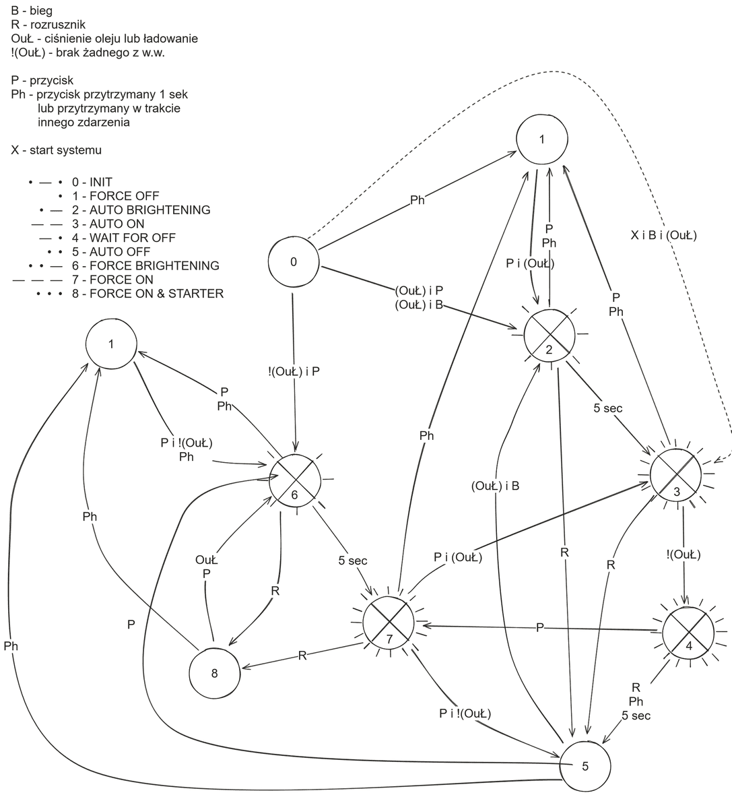
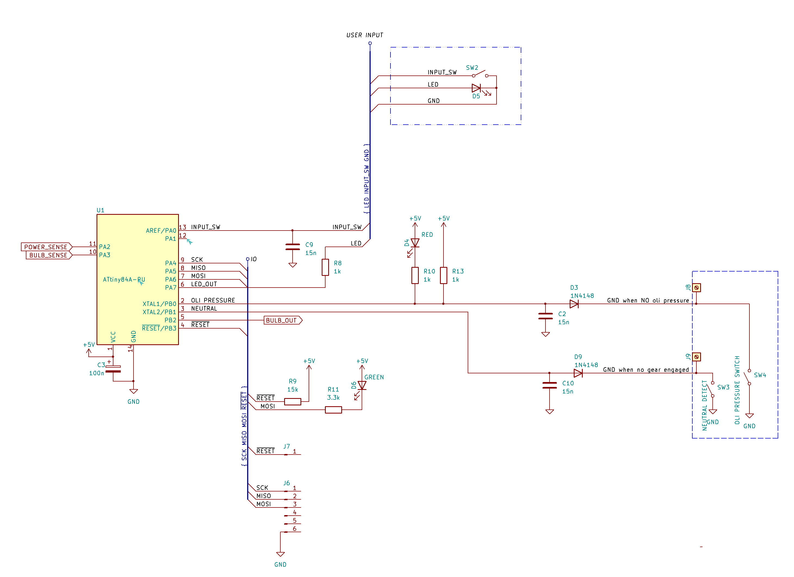

# Cel projektu

Celem projektu było zbudowanie prostego urządzenia, które wyłączy światła mijania, gdy nie są potrzebne.
Dedykowane dla motocykla Suzuki V-Strom 650, roczniki od 2017 wzwyż.

## Od strony użytkownika

Zacznijmy od tego, że podchodzę do motocykla, włączam stacyjkę. Normalnie światła już świecą, ale po co. Póki co mam odcięty zapłon na _kill-switch_, a bieg na luzie. Włączam _kill-switch_, odpalam moto, ale ja przecież jeszcze nigdzie nie jadę - kask trzeba ubrać, wsiąść, stopkę złożyć. I gdy już to wszystko jest zrobione, włączam bieg (magia, ta dam), światła się zapalają, a ja odjeżdżam. Niekoniecznie w stronę słońca, bo czasem razi, ale na pewno gdzieś daleko.

Dojeżdżając do skrzyżowania, wrzucam luz, ale wtedy światła już nie gasną. No chyba, że dojechałem do przejazdu kolejowego, i wiem, że chwilę postoję. Gaszę wtedy silnik, a po chwili światła automatycznie gasną. Zapalą się znów, gdy będzie włączony silnik i bieg.
A gdyby mi po drodze przez przypadek zgasł silnik, to światła zgasną również na czas kręcenia rozrusznikiem.

Dodatkowo, mam do dyspozycji przycisk, który zmienia stan świateł na przeciwne (włączone-wyłączone). Przykładowo, gdy chcę sobie poświecić. Albo na czas jazdy w _offie_ wyłączyć światła.

Funkcjonalność, której niestety nie zweryfikowałem w praktyce to utrzymywanie napięcia na żarówce na poziomie około 13,2 V napięcia skutecznego pomimo wahań napięcia w instalacji motocykla. Celem tego zabiegu jest przedłużenie żywotniści żarówki świateł mijania. Niestety, jak napisałem, z braku czasu nie sprawdziłem realnego zasięgu świateł przy obniżonym napięciu zasilania vs pełne napięcie z alternatora. Niemniej jednak obecnie zbudowany prototyp został wyposażony w czujnik zmierzchowy, który można włączyć w obwód przez aktualizację oprogramowania, i w przypadku wykrycia jazdy po zmierzchu, zasilić żarówkę pełną mocą. 

## Dioda

Dioda generalnie odzwierciedla stan świateł, tzn. powinna być włączona, gdy światła są włączone, oraz wyłączona, gdy są wyłączone.
Dodatkowo, po włączeniu stacyjki, świeci się przez trzy sekundy, nawet jeżeli światła są wyłączone.

Jeżeli dioda miga krótkimi, pojedynczymi „mrugnięciami”, bądź w podobny sposób gaśnie, to znaczy, że żarówka albo bezpiecznik są przepalone.

Po zgaszeniu silnika, ale zanim światła zgasną, jest jeszcze 5-cio sekundowy okres, w trakcie którego dioda świeci przez 0,8 sek, a następnie gaśnie na 0,2 sek.

Natomiast stan, gdy żarówka właśnie się zapala jest sygnalizowany świeceniem przez pół sekundy, i podobnie kolejne pół gaśnie. 

## Przycisk

Przycisk generalnie zmienia stan układu na przeciwny. Od tej reguły jest jeden wyjątek - przyciśnięcie go, gdy światła mają za chwilę zgasnąć (po zgaszeniu silnika) powoduje, że pozostaną włączone. Dodatkowo, przytrzymanie przycisku na dłużej niż sekundę zawsze gasi światła.

Powyższy diagram wydaje się być przerażająco skomplikowany, ale tak naprawdę realizuje logikę pozwalającą przełączać i automatycznie gasić światła.

Po załączeniu stacyjki aplikacja jest w stanie początkowym - 0.
Naciskając przycisk przy zgaszonym silniku wymuszamy włączenie i pozostawienie świateł włączonych - stany 6 i 7.
Naciskając przycisk przy włączonym silniku zapalamy światła, jednocześnie pozwalając im zgasnąć, gdy silnik zostanie zgaszony - stany 2 i 3.
Przytrzymując przycisk wymuszamy zgaszenie świateł - stan 1.

W stanie 2 światła się rozjaśniają, by automatycznie przejść do stanu 3, w którym świecą, ale mogą zgasnąć (stan 5) po pewnym czasie od zgaszenia silnika (stan 4 - przejściowy).

Podobnie ze stanu 5 po odpaleniu silnika światła się zapalą - stany 2 i 3.

Stany 6 i 7 to wymuszone włączenie świateł - nie zgasną po zgaszeniu silnika, a tylko na czas kręcenia rozrusznikiem (stan 8).

## Diody diagnostyczne

Na płytce umieszczono dwie dodatkowe diody LED - czerwoną, która jest de facto odpowiednikiem sygnalizacji braku ciśnienia oleju w silniku, oraz zieloną, która kodem Morse'a odzwierciedla obecny stan aplikacji.

# Sprzęt

## Mikrokontroler

Projekt został zrealizowany w oparciu o ATTiny 84A, aczkolwiek powinien dać się zaadaptować na inne mikrokontrolery o podobnych możliwościach sprzętowych. W szczególności na rodzinę ATTiny x4A.

### FUSE bits

Do domyślnej konfiguracji mikrokontrolera zostały wprowadzone następujące zmiany:
* włączenie timera watchdog,
* ustawienie detekcji spadku napięcia zasilania na około 4,3 V. Poniżej tej wartości mikrokontroler jest zablokowany w stanie RESET,
* praca z wewnętrznym zegarem 8 MHz.

**hfuse** - `0xCC`
**lfuse** - `0xE2`

## Moduł mocy

Moduł mocy oparty jest o tranzystor Q5 MOSFET IRFZ44N. Pozwala on na sterowanie prądem do 49 A przy oporności załączonego tranzystora na poziomie 17,5 mΩ. Żarówka pobiera mniej niż 5 A, i w takim stanie na tranzystorze jest tracone do 0,5 W mocy.

Sterowanie tranzystora Q5 jest zrealizowane za pomocą wzmacniacza w konfiguracji _totem pole_ Q2 i Q3 i adaptera poziomu TTL do 12V Q1. Ładowanie bramki odbywa się dodatkowo przez rezystor R16 10 kΩ. Zabieg ten ma na celu wydłużenie czasu przełączania tranzystora Q5, co powoduje zmniejszenie skoków prądu w instalacji, a tym samym generowanych przepięć i zakłóceń.

Jak wykazały testy, mimo pracy tranzystora Q5 przez pewną część czasu w obszarze liniowym, straty mocy na w/w tranzystorze są na tyle niewielkie, że nie wymaga on dodatkowego chłodzenia.

Na płytce zostało też wyprowadzone złącze J6. Domyślnie zwarte są nóżki 4 i 5. Ich rozwarcie powoduje, że tranzystor Q5 będzie zawsze w stanie nasycenia (żarówka włączona). Zwarcie nóżek 5 i 6 zwiera bramkę do masy, tym samym rozłączając tranzystor i gasząc żarówkę.

## Interfejsy z systemami motocykla

### Kabelkologia

Moduł mocy został wpięty w obwód żarówki świateł mijania za pomocą złącza o nr 11155 od strony motocykla, oraz 11156/12634 w kierunku żarówki. Dzięki takiemu rozwiązaniu awarię można wyeliminować rozpinając (wypinając) moduł z instalacji motocykla, i łącząc żarówkę po staremu - na krótko. Drugim sposobem eliminacji awarii jest rozłączenie nóżek 4 i 5 w złączu J6. Co prawda w takim przypadku nadal na ścieżce pozostaje tranzystor mocy Q5, ale jest to również rozwiązanie łatwiejsze i szybsze do przeprowadzenia. 

**UWAGI:** 

Ja zakupiłem takie złącza po okazyjnej cenie na pewnym dalekowschodnim portalu aukcyjnym. Jakość wykonanie wydaje się nie urągać europejskim standardom. Natomiast kupując te złącza należy zwrócić uwagę, aby kupić nie tylko obudowę (ang. *housing*), ale także PINy oraz uszczelnienia.

Od strony motocykla w złączu świateł mamy zasilanie 12 V po bezpieczniku świateł mijania - przewód w kolorze czarnym z niebieskim paskiem (B/Bl) - łączymy go z J5 układu, i jednocześnie przekazujemy dalej - na żarówkę. Przewód w kolorze czarnym z białym paskiem (B/W) to standardowo masa, i tę masę łączymy z J1 układu. Natomiast J10 wyprowadzamy na żarówkę.

Pomocny może być poniższy schemat:

**UWAGI:** 

1. Przed połączeniem czegokolwiek należy upewnić się, że na właściwych PINach motocykla mamy właściwe przewody, czyli masę oraz zasilanie w odpowiednim miejscu. Tutaj po prostu włączamy zapłon i sprawdzamy, czy napięcie 12 V jest w tym miejscu, w którym chcemy. 
Montując wtyczkę niestety łatwo o błąd i zamianę pinów lewego z prawym, a taka zamiana spowoduje, że układ nie będzie nam działał.
2. Przekazanie mocy na żarówkę należy wykonać przewodami o przekroju co najmniej 0,75 mm². Odnogę zasilania (J5) można już puścić cieńszym przewodem.
3. Lutując przewody mocy w układzie najlepiej przylutować je bezpośrednio do nóżek tranzystora, uważając przy tym, aby go nie przegrzać.

Połączenie J2 - dodatkowe zasilanie, jest opcjonalne, ale bez niego układ nam nie wykryje przepalenia bezpiecznika świateł mijania. Ja podłączyłem się do przewodu w kolorze białym z zielonym paskiem (W/G) - pojawia się tam napięcie po przekręceniu kluczyka, zabezpieczone bezpiecznikiem SIGNAL.

Połączenie J4 - dodatkowa masa. Dzięki temu można bezpiecznie rozłączyć wiązki prowadzące do świateł.

Połączenie J8 - wykrywanie braku ciśnienia oleju. Przewód zielony z żółtym paskiem (G/Y) - w momencie braku ciśnienia oleju jest zwierany do masy motocykla.

Połączenie J9 - wykrywanie biegu neutralnego. Przewód niebieski z czarnym paskiem (Bl/B) - w momencie wrzucenia „luzu” jest zwierany do masy motocykla.

Ja się wlutowałem w wiązkę w okolicach czachy motocykla.

Przy okazji przewody:
* czarnym z białym paskiem (B/W) to standardowo masa,
* czerwony z białym paskiem (R/W) to zasilanie dostępne nawet po wyjęciu kluczyka. Zabezpieczone bezpiecznikiem FUEL.

**UWAGI**

Przed przylutowaniem czegokolwiek najpierw sprawdź, czy to na pewno dobry przewód, i czy „zachowuje się” zgodnie z oczekiwaniami.

Wszystkie testy prowadź w takie sposób, że:
1. odłączasz ECM (dwie wtyczki) oraz zegary (jedna wtyczka) - jak coś spieprzysz, to najwyżej wyleci bezpiecznik,
2. minus miernika łączysz z masą motocykla, plus z punktem, który chcesz sprawdzić,
3. znajdź cieniutki, ale bardzo cieniutki stalowy drucik (ja mam taki ze sprężynki), i wsuwaj go do gniazda, np. po odpięciu zegarów,
4. odsuwając gumową osłonę wtyczki zegarów można sprawdzić kolory izolacji przewodów,
5. jeżeli sprawdzasz napięcie w obwodzie, sprawdź również, czy po przekręceniu kluczyka znika (bądź nie), oraz czy po wyjęciu odpowiedniego bezpiecznika znika.

# Programowanie

Ja korzystam po taniości z płytki Arduino połączonej z mikrokontrolerem, oraz _skeczu_ ArduinoISP dostępnego w ArduinoIDE.
Programowanie mikrokontrolera odbywa się przez `avrdude`, i np. żeby wejść w tryb interaktywny, należy wydać polecenie: `avrdude -v -p attiny84 -c arduino -P COM6 -b 19200 -t`, gdzie `COM6` oznacza nr portu, pod którym zarejestrowała się płytka Arduino podpięta do komputera.

Programowanie _fuse bit_ można wykonać wydając polecenie (w trybie interaktywnym `avrdude`):  
`write lfuse 0 0xE2`
`write hfuse 0 0xCC`  

# Oprogramowanie

Prawdopodobnie będziesz potrzebował(a) Microchip Studio, albo przynajmniej `avr-gcc`. 

